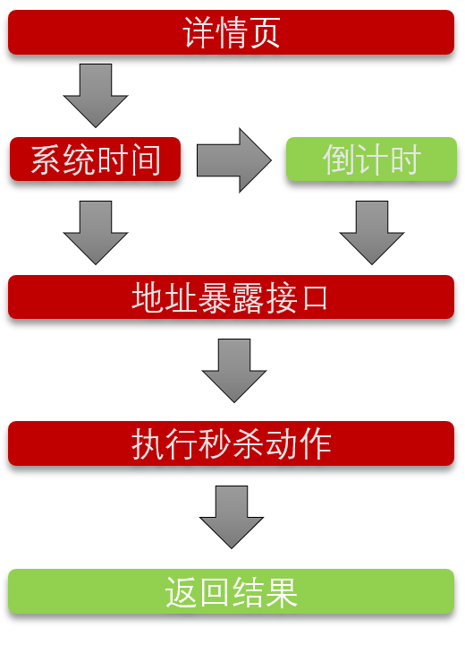

### 高并发秒杀系统

##### 参考学习网站[慕课网](http://www.imooc.com/learn/587)

#### 主要利用的框架SSM(Spring + SpringMVC + Mybatis)

#### 主要框架和工具简介

* <h5>Spring</h5>
> Spring是一个基于IOC和AOP的结构J2EE系统的框架，IOC(Inversion Of Control)反转控制是Spring的基础，简单说就是创建对象由以前的程序员自己new 构造方法来调用，变成了交由Spring创建对象，DI(Dependency Inject)依赖注入，简单地说就是拿到的对象的属性，已经被注入好相关值了，直接使用即可。 
  
* <h5>SpringMVC</h5>
> Spring 配备构建Web 应用的全功能MVC框架。Spring可以很便捷地和其他MVC框架集成，如Struts，Spring 的MVC框架用控制反转把业务对象和控制逻辑清晰地隔离。它也允许以声明的方式把请求参数和业务对象绑定。
  >
  > spring mvc是一个基于mvc的web框架。spring mvc是spring框架的一个模块，springmvc和spring无需通过中间整合层进行整合。
  
* <h5>Mybatis</h5>
> MyBatis 是一款优秀的持久层框架，它支持定制化 SQL、存储过程以及高级映射。MyBatis 避免了几乎所有的 JDBC 代码和手动设置参数以及获取结果集。MyBatis 可以使用简单的 XML 或注解来配置和映射原生信息，将接口和 Java 的 POJOs(Plain Old Java Objects,普通的 Java对象)映射成数据库中的记录。
  
* <h5>Radis</h5>
> Redis是一个开源的使用ANSI C语言编写、支持网络、可基于内存亦可持久化的日志型、Key-Value数据库，并提供多种语言的API。换句话说，Redis就像是一个HashMap，不过不是在JVM中运行，而是以一个独立进程的形式运行。一般说来，会被当作缓存使用。 因为它比数据库(mysql)快，所以常用的数据，可以考虑放在这里，这样就提高了性能。
  >

#### 系统逻辑框架

**注：**红色流程框中可以进行相应的优化动作

##### 针对高并发进行的优化

1. **采用Radis缓存**

   > 在Service层，首先从Redis缓存中查找对应的秒杀商品信息，如果没有命中，才去数据库中查找，命中数据后，将商品信息缓存到Redis中，并设置数据的生存时间，这样在高并发的情况下，可以有效降低数据库查询时延。

2. **数据库操作顺序调整**

   > 由于要保持数据库查询的原子性(Atomicity)、一致性(consistency)、隔离性(Isolation)、持久性(Durability)，因此在进行商品减库存时需要对操作数据加入行级锁，要保证行级锁影响的数据库操作尽可能的小，因此调整数据库操作为：先尝试插入秒杀成功信息表单，因为表主键为商品id和用户手机号，可以有效过滤掉重复用户秒杀；插入操作成功后，再尝试去进行减库存的逻辑操作。若在这个过程中发生错误，则数据库进行回滚(rollback)操作。

3. **数据库存储事务过程**

   > 插入秒杀成功用户信息和减库存操作一次性在数据库中进行，有效避免了网络延迟和Java GC(Garbage Collection)的影响(不采用存储过程会有2次网络往返延时，第一次执行插入操作并返回结果，由程序判断是由进行减库存操作)，程序只需要判断存储过程的返回结果即可。

#### 系统工程部署

> 工程采用Maven方式创建，使用tomcat部署号项目，并启动Redis服务，访问<http://localhost:8080/seckill/list>即可看到秒杀商品列表页。
>
> 数据库采用的是8.0.13版本，部署工程时注意修改相关的数据库连接参数

